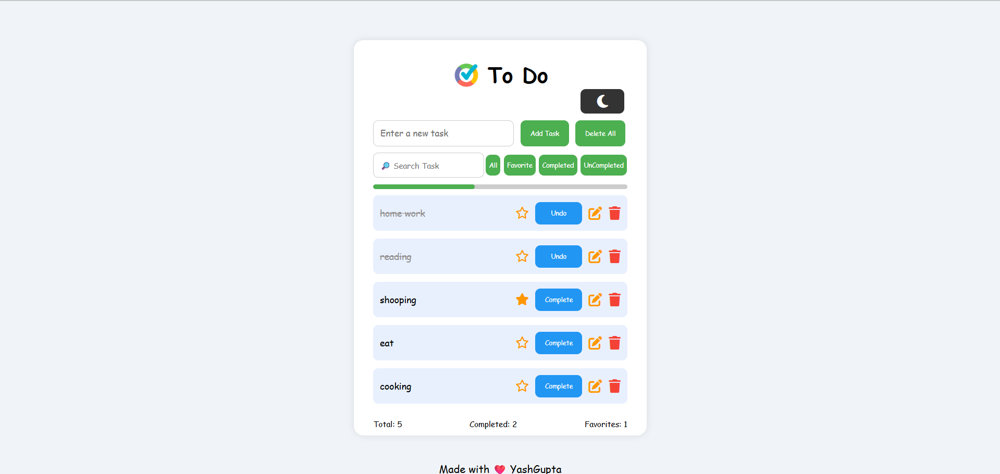

# ✅ To-Do List Web App

A fully functional and responsive **To-Do List Web Application** developed using **HTML**, **CSS**, and **JavaScript**. This app helps users manage their daily tasks efficiently with features like task filtering, local storage support, and light/dark mode toggle.

## 🔗 Live Demo  
[Click here to view the live project](https://yashgupta7373.github.io/ToDo-WebApp/)

## 💻 GitHub Repository  
[View Source Code on GitHub](https://github.com/yashgupta7373/ToDo-WebApp)

## 🖼️ Screenshot  

## ✨ Features

- 📝 Add, edit, complete, undo, and delete tasks  
- 🌑 Light and Dark Mode toggle for better user experience  
- 📥 Tasks are saved in **Local Storage** — no data loss on refresh  
- 🔍 Search tasks by keyword  
- ⭐ Mark tasks as **Favorite**  
- 🧮 Task stats: Total, Completed, Favorite  
- 📱 **Fully responsive** design for mobile, tablet, and desktop  
- ✅ Filters to view All, Completed, Uncompleted, and Favorite tasks  
- 💡 Intuitive UI/UX with clean layout and modern design

## 🛠️ Technologies Used

- **HTML5** – Structure  
- **CSS3** – Styling and responsiveness  
- **JavaScript (ES6)** – Logic and interactions  
- **Local Storage** – Data persistence

## 🎯 Purpose

This project was built to practice and showcase skills in:

- DOM Manipulation  
- Local Storage API  
- Responsive Web Design  
- Light/Dark theme toggle  
- Clean code structure